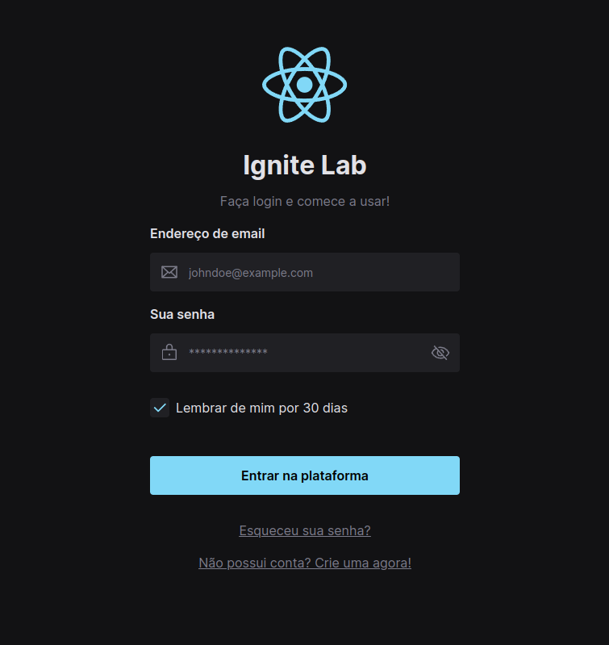

<h1 align="center">
  Ignite Lab Design System
</h1>

- - -

<h1 align="center" >Preview</h1>

 
  

 

## Tecnologias

 Esse projeto foi desenvolvido com as seguintes tecnologias:

- VITE
- REACT
- TAILWINDCSS
  
## Projeto

 Caso queira rodar essa aplicação em sua máquina, basta usar os comandos: 

 - npm install
 - npm run dev

 Para visualizar a documentação dos componentes que foi feita utilizando o StoryBook, [clique aqui](https://enandorta.github.io/ignite-lab-design-system/?path=/story/components-button--default).